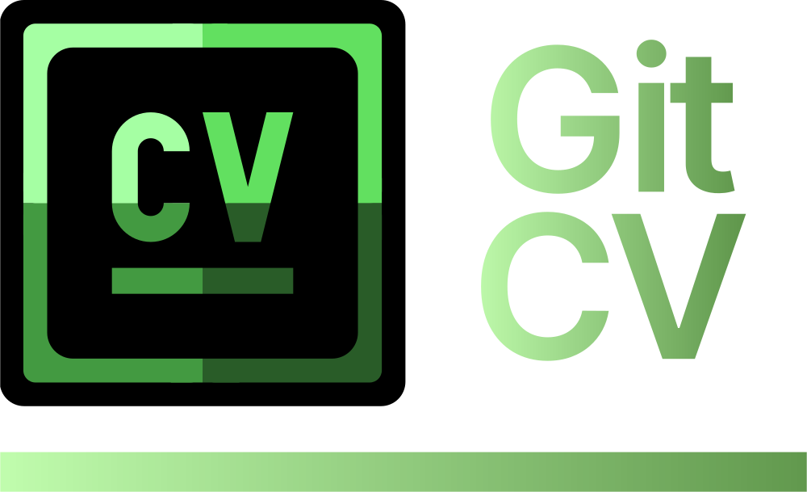

<div align="center">

<a href="https://gitcv-app.vercel.app/">
  
</a>

<br/>

[](https://gitcv-app.vercel.app/)
[](LICENSE)
[]()
[]()

</div>

---

# 📑 CVHub

> Transform GitHub profiles into professional, exportable CVs.

## 🚀 Overview

**CVHub** is a modern web application that converts GitHub profiles into visually rich, structured, and professional PDF resumes.

It goes beyond simple data extraction by preserving **visual hierarchy, Markdown rendering fidelity, and repository insights**, producing a portfolio-grade CV suitable for recruiters, interviews, and professional networking.

---

## 🎯 Core Value Proposition

- Converts **GitHub profiles → professional CVs**
- Preserves **visual identity + content structure**
- Generates **print-ready PDF documents**
- Focused on **developer experience + recruiter readability**

---

## 🧑‍💻 Features

### 👤 Profile Intelligence
- GitHub avatar, username, and bio rendering
- Followers, following, and public repositories metrics
- Clean profile summarization layer

### 📦 Repository Insights
- Top repositories ranking
- Direct GitHub links
- Structured repository presentation

### 📄 README Rendering Engine
- Full Markdown support with:
  - Tables
  - Images
  - Links
  - Code blocks
- Safe HTML rendering pipeline using sanitization layers

### 📤 PDF Export System
- High-fidelity export using `html2canvas` + `jsPDF`
- Preserves:
  - Layout structure
  - Colors & theme
  - Visual hierarchy
- Print-ready output

### 🎨 UI/UX System
- Light / Dark mode support
- Responsive layout (mobile-first)
- Minimal, recruiter-focused interface

---

## ⚙️ Tech Stack

### Frontend
- React.js (component-driven architecture)
- CSS Modules / Custom styling system

### Rendering Engine
- `react-markdown`
- `remark-gfm`
- `rehype-raw`
- `rehype-sanitize`

### Export Layer
- `html2canvas` (DOM → image pipeline)
- `jsPDF` (PDF generation engine)

### External APIs
- GitHub REST API (public profile data)

---

## 🧠 System Architecture

GitHub API → Data Layer → UI Renderer → DOM Snapshot → PDF Engine → Export

---

### Key Design Principles
- Stateless UI rendering
- API-driven content composition
- Client-side PDF generation (no backend dependency)

---

## ⚙️ How It Works

1. User inputs a GitHub username
2. System fetches public profile data via GitHub API
3. Data is normalized into a CV schema
4. UI renders structured profile + repositories + README
5. Export engine captures rendered DOM
6. PDF is generated and downloaded locally

---

## 📦 Versioning

| Version | Status | Notes |
|--------|--------|------|
| 1.0.0  | Stable | Initial production-ready release |
| 1.1.0  | Planned | Custom themes + layout editor |
| 2.0.0  | Roadmap | Multi-profile + portfolio mode |

---

## 🧭 Roadmap

- [ ] Clickable links inside PDF export
- [ ] CV customization engine (fonts, layout, spacing)
- [ ] Multi-profile comparison mode
- [ ] Portfolio hosting mode (public CV pages)
- [ ] AI-based CV optimization suggestions

---

## 🤝 Contributing

We welcome contributions.

### Workflow
```bash
1. Fork the repository
2. Create a feature branch
   git checkout -b feature/your-feature
3. Commit changes
   git commit -m "feat: add new feature"
4. Push branch
   git push origin feature/your-feature
5. Open a Pull Request
```

# 📜 License

This project is licensed under the **Apache License 2.0** – see the LICENSE file for details.


<div align='center'>

CVHub — turning developer profiles into career-ready documents.
</div>


